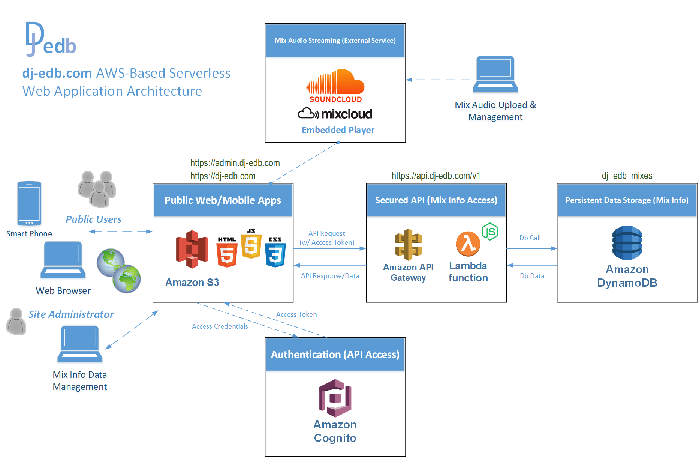

# project: dj-edb-webapp
**dj-edb Web Application** - *Project design documentation &amp; reference repository*

## Overview:
This project serves as a journal to document and chronical the development of a Web Application that allows the public to easily listen to my DJ Mixes over the Internet.  This project merges two of my passions: IT/Computing/Programming and Music (House Music DJ'ing). This Application is built "in the Cloud", using **Amazon Web Services (AWS)** - https://aws.amazon.com/. I've been educating myself on the AWS Cloud Platform, with the goal of earning multiple AWS Certifications in 2019 - https://aws.amazon.com/certification/ (*Cloud Practioner, Solutions Architect Associate, & Developer Associate*). This project is a practical application of what I've learned thus far (via online training) - https://acloud.guru/. This is in conjunction with the Web development skills I've acquired in recent years (through online trainig and experimentation).

This Application is ***"serverless"*** in its design - https://aws.amazon.com/serverless/. Meaning no physical or virtual servers are provisioned.  Instead, the Application is comprised of a collection of AWS services that work together to execute code and deliver the user experience:

* **S3:** The AWS File Object Storage service. It hosts the static Web Sites and cover art files. https://docs.aws.amazon.com/s3/index.html#lang/en_us

* **Cognito:** The AWS Authentication service. It stores and authenticates users' credentials and provides access tokens for the Backend REST API (data access). https://docs.aws.amazon.com/cognito/index.html#lang/en_us

* **API Gateway:** The AWS Web API Service. It provides a Client access interface (REST) to the Lambda Function that accesses the Database. https://docs.aws.amazon.com/apigateway/latest/developerguide/welcome.html

* **Lambda:** The AWS scalable Runtime environment host for executing re-usable, functional, code. In this application, it is used to execute the Database access code. Lambda supports most popular Runtime Evironments (Java, .NET, etc...). This project uses the **NodeJS** Runtime - https://nodejs.org/ (***Javascript***). https://docs.aws.amazon.com/lambda/index.html?id=docs_gateway#lang/en_us

* **DynamoDB:** The AWS NoSQL database in the Cloud. It hosts the data table containing the Mix information displayed the Frontend Client. https://docs.aws.amazon.com/dynamodb/index.html?id=docs_gateway#lang/en_us

**Serverless** architectures have emerged as a popular design pratice that allows applications to be developed, deployed, and scaled in a highly-effcient, and highly-available fashion. This project was modeled after an AWS sample project: https://aws.amazon.com/getting-started/projects/build-serverless-web-app-lambda-apigateway-s3-dynamodb-cognito/

The dj-edb Application consists of 2 major sub-projects:

* **Back-end:** A REST API and Database to manage and exchange data with Frontend Clients, along with an Authentication Mechanism to secure data access.

* **Front-end:** Browser-based Clients that communicate with the Back-end to access and manage Mixes. The Application has separate Clients for playing Mixes and administering the Mix Information stored in the Back-end.

The **Back-end** is built out and tested first. Next, the **Front-end** is designed and deployed (first, the private Admin site and finally, the public Mix Audio site).

**Javascript** code is used for the both the Back-end (NodeJS - https://nodejs.org/en/) and Front-end (Angular - https://angular.io/). 

The Mix audio is streamed via online/Cloud services from SoundCloud https://soundcloud.com and MixCloud https://mixcloud.com. Both services allow users to upload audio files and embed streaming audio players (via HTML iframe) into their own custom site/application (dj-edb.com).

Below is a diagram that provides an architectural overview of the Application:

